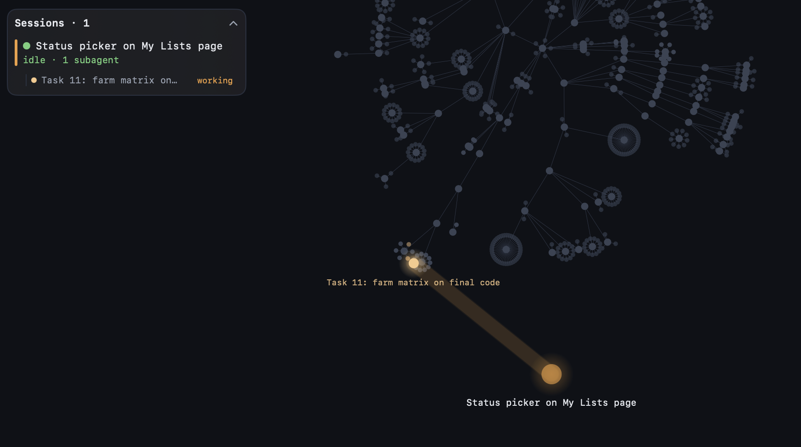

# SessionVis

A native macOS visualiser for live Claude Code sessions. Point it at a directory and it tails the Claude Code transcripts for that directory (and its `.claude/worktrees` checkouts), draws the repo as a gource-style radial graph, and shows each session as an orb that fires beams at the files it reads and edits. Subagents are smaller orbs inside their parent's halo. A touched file flashes in the session's colour, then keeps a tint of it that fades back to grey over two minutes, so you can see where each agent has recently been. A floating list mirrors iTerm's Session Status panel.

## Run

    swift run SessionVis --dir /path/to/repo            # live
    swift run SessionVis --replay <transcript.jsonl> --speed 20 --dir /path/to/repo
    scripts/bundle-app.sh && open dist/SessionVis.app --args --dir /path/to/repo

The directory must be passed with `--dir`; a bare path argument is treated by AppKit as a document to open and no window appears.

Trackpad scroll pans, pinch zooms, double-click refits. Click a session in the list to follow it. ⌘L collapses the list, ⌘O opens another directory, ⌘, shows settings including the optional hook snippet for exact "waiting on permission" states.

## Privacy

- To find which sessions belong to the directory, SessionVis reads the head of every transcript under `~/.claude/projects` (up to 256 KB each, only for transcripts modified in the last 30 minutes) and then tails the member transcripts.
- The session list shows prompt text (session titles fall back to the first prompt; waiting rows preview the question).
- The optional hook writes raw hook payloads (prompts, tool inputs and outputs) to `~/Library/Application Support/SessionVis/hooks` only while SessionVis is running (it checks a marker file the app creates on open and removes on quit). SessionVis deletes each file as it reads it and prunes leftovers older than an hour.
- Nothing leaves your machine.

## Status

What you can check by hand:

- Two-finger pan, pinch zoom, double-click to refit the view.
- Hover tooltips on files and orbs.
- Files recently touched are tinted in the toucher's colour and fade back to grey over two minutes; the tooltip names the last toucher for the same window.
- A subagent fades out within a few seconds of finishing, whether it ran in the foreground or in the background (its final hand-back call and the parent's task notification both count as the end).
- ⌘L collapses and expands the session list.
- ⌘, opens settings with the hook snippet.

## Known gaps

- File changes on disk (including deletions and moves) are picked up by an FSEvents watcher within about half a second; deletions fade out red, moves glide. They are not attributed to an agent.
- Phantom-file reconciliation (files an agent touched that do not exist) relies on a filesystem existence check, so gitignored files an agent really wrote stay visible.
- Directory renames animate as per-file moves.
- `.git` churn triggers rescans (cheap).
- Hover is not refreshed while panning under a still cursor.

## Develop

    swift test
